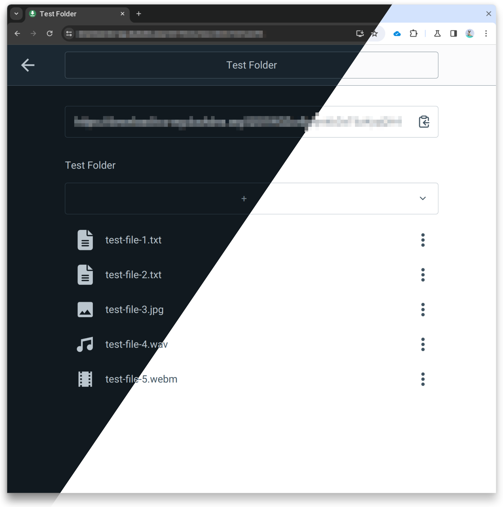

# Upload Share

A simplistic file-sharing service for self hosting.



## Developing

Once you've created a project and installed dependencies with `npm install` (or `pnpm install` or `yarn`), start a development server:

```bash
npm run dev

# or start the server and open the app in a new browser tab
npm run dev -- --open
```

## Configuration

The application is configured via environment variables provided in the file `.env`.
```bash
# Copy the default configuration file
cp .env.example .env
```

The file can be used for developing and production builds. However, build-time variables (see
`.env.example`) will be burnt into the docker image.

## Building Docker Images

```bash
# Current platform
docker build . -t upload-share --pull
# Arm64
docker run --rm --privileged multiarch/qemu-user-static --reset -p yes
docker build . -t upload-share --platform=linux/arm64 --pull
```

## Save and Load Docker Image from File

```bash
docker save -o upload-share.tar upload-share
docker load -i upload-share.tar
```

See `scripts/deploy.sh` for a complete example of building and deploying via Docker / Podman.

## Deploying With Docker Compose

The application can be deployed using the provided `docker-compose.yml`. Configuration has to be provided with an `.env` file in the same directory.

## License

This software is distributed under the [GNU General Public License Version 3](./LICENSE).

The icon is based on a [Material Design Icon](https://github.com/material-icons/material-icons/blob/master/svg/download/round.svg) licensed under the [Apache License 2.0](https://github.com/material-icons/material-icons/blob/master/LICENSE).